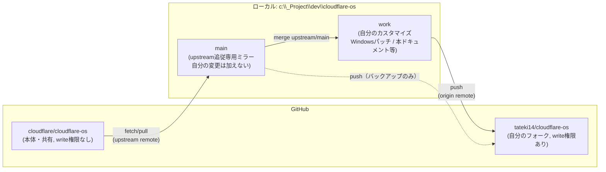

# Cloudflare OS — セットアップ仕様

このディレクトリは [cloudflare/cloudflare-os](https://github.com/cloudflare/cloudflare-os) をクローンしたローカル環境。
今後、この作業ディレクトリに関する仕様・変更は本ファイルに追記していく。

## Cloudflare OSとは

Cloudflareが2026年8月に発表した、社内向けに開発されたAI生産性環境("operating system for AI productivity")のOSS版。
エンジニアから営業まで、Cloudflare社内で日常的に使われているツールをそのまま公開したもの。

自社に合わせてカスタマイズし「Your Company OS」として使うことを想定している。

### 提供される主な機能

1. **エージェントチャットUI** — 会社の運用に関する知識を事前に持ったエージェントにタスクを依頼できる
2. **サンドボックス化されたアプリ開発（Gadgets）** — エージェントに小さな個人用アプリ("gadget")を作らせ、安全に他者と共有できる
3. **Gatekeepers（セキュリティフレームワーク）** — エージェント/アプリの外部サービスアクセスにガードレールをかける仕組み。非技術者でも安全に使える

### アーキテクチャ対応表（README記載）

| 通常のOS | Cloudflare OS |
|---|---|
| kernel | `packages/workshop-backend` |
| device drivers | `packages/gatekeeper-*` |
| shell | `packages/workshop-frontend` |
| processes | gadgets |
| executables | blueprints |

Cloudflare Workers上に構築され、Durable Objects / Dynamic Workers / Facets を利用。

## リポジトリ構成（クローン元: cloudflare/cloudflare-os, `main`）

- `packages/` — workshop-backend（kernel）, workshop-frontend（shell）, gatekeeper-*（外部サービス連携）など
- `scripts/run-local.mjs` — ローカル一括起動スクリプト
- `run-dev-server.js` — 開発用バックエンドサーバー起動
- `docs/` — アップストリームの技術ドキュメント（AI Gateway課金、blueprints、OAuthサインイン等）

## 環境情報（このマシン）

| 項目 | バージョン/状態 |
|---|---|
| Node.js | v24.13.1 |
| pnpm | 10.29.3 (リポジトリ指定は `pnpm@11.17.0`) |
| wrangler | 4.65.0（グローバル。リポジトリは `^4.119.0` を要求） |
| Cloudflareアカウント | ログイン済み（OAuth）。account id: `f8e94dd623d720dc98c3e74878e38c51` |

不足しているOAuthスコープ: `ai-search:write`, `ai-search:run`, `secrets_store:write`, `containers:write`, `cloudchamber:write`, `connectivity:admin`
→ これらの機能を使う場合は `wrangler login` で再認証が必要。

## セットアップ手順（採用した方法: ローカルQuick Start）

本番運用ではなく、まずプロダクトの動作確認を目的として、READMEの Quick Start を採用。

```bash
git clone https://github.com/cloudflare/cloudflare-os.git .
pnpm run-local
```

- アクセスURL: http://localhost:8787
- データ保存先: `.wrangler/` ディレクトリ配下（本番用途ではない）
- `wrangler` と `workerd` でスタック全体をローカル実行する

### 開発モード（フロントエンド/バックエンドを分離して動かす場合）

```bash
pnpm dev-server   # ターミナル1: バックエンド
pnpm dev-client   # ターミナル2: フロントエンド
```

- アクセスURL: http://localhost:3000

## 本番デプロイ（実施済み: 2026-08-09）

### 構成

- デプロイ方式: [cloudflare/cloudflare-os-starter](https://github.com/cloudflare/cloudflare-os-starter)（Cloudflare Access連携の本格運用向けスターター）
- ローカルクローン先: `c:\_Project\dev\cloudflare-os-starter`（本ディレクトリ `cloudflare-os` の兄弟ディレクトリ。starter内の `cloudflare-os/` サブモジュールとして core repo を別途取得している。本ディレクトリのクローンとは別物）
- Gitリポジトリ: [tateki14/cloudflare-os-starter](https://github.com/tateki14/cloudflare-os-starter)（private）。アップストリームの `cloudflare/cloudflare-os-starter` から origin を張り替えてpush
- 公開URL: `https://cloudflare-os.10good.org`（Cloudflare Access保護下）
- Worker名: `cloudflare-os-workshop` / `cloudflare-os-context` / `cloudflare-os-gatekeeper` / `cloudflare-os-error-reporter`
- サインイン方式: Cloudflare Access（issuer: `https://tatekao14.cloudflareaccess.com`）。管理者: `tatekao14@gmail.com`
- AI Gateway: 無効（`aiGateway.enabled: false`）。必要になれば `docs/customization.md` の手順で有効化
- ストレージ: KV/R2は全て自動プロビジョニング（`null`指定）。`cloudflare-os-workshop-blueprints` / `cloudflare-os-workshop-avatars` (KV), `cloudflare-os-workshop-blueprint-content` (R2) が作成された

### 実施手順

1. `git clone https://github.com/cloudflare/cloudflare-os-starter.git` → `git remote remove origin` → `gh repo create tateki14/cloudflare-os-starter --private --source=. --remote=origin --push`
2. `git submodule update --init`（core repoをsubmoduleとして取得。upstream `cloudflare/cloudflare-os` を指したまま、書き込み権限なし）
3. `pnpm install` → `pnpm --dir cloudflare-os install`
4. Cloudflareダッシュボード（Zero Trust → Access → Applications）でセルフホスト型Accessアプリを手動作成（ホスト名 `cloudflare-os.10good.org`）。AUD TagはUIに表示されなかったため、Access:Apps and Policies Read権限のAPIトークンを一時発行し `GET /accounts/{account_id}/access/apps` で取得。取得後トークンは失効済み
5. `deployment.jsonc` に accountId・Worker名・customDomain・access.issuer/audience/admins・customGatekeeper表示文言を設定（詳細は同ファイル参照。シークレットは含まない）
6. `pnpm check`（`scripts/deploy.mjs --check`、dry-run）→ 全4 Workerで成功を確認
7. `pnpm deploy` → 本番デプロイ成功。`cloudflare-os.10good.org` へのGETがHTTP 302でCloudflare Accessログイン画面にリダイレクトされることを確認（認証保護が正しく機能）
8. starter本体の変更（`deployment.jsonc`, `scripts/deploy.mjs`）をコミットし `tateki14/cloudflare-os-starter` にpush。submodule内のWindowsパッチはアップストリームへの書き込み権限がないためコミットせず、ローカルの作業ツリーにのみ存在（下記「Windows環境での既知の問題」参照）

### 他の選択肢（未使用）

- **公式デプロイフロー**: https://os.cloudflare.app/deploy — ブラウザのウィザードで簡易デプロイ。Access連携等の細かい制御はできないため今回は不採用
- **workerd単体でのセルフホスト**: README記載時点でドキュメント未整備（Coming Soon）

## 外部サービス連携（Gatekeepers）

各Gatekeeperパッケージに個別のセットアップ手順あり。必要になったものだけ設定する。

- GitHub / Google / Cloudflare / Supabase / Notion / Confluence / Email Workers / Home Assistant / Slack / Spotify / ZoomInfo

（詳細は `packages/gatekeeper-*/README.md` を参照）

## Git運用方針（フォーク + upstream追跡）

**方針**: 本体（`cloudflare/cloudflare-os`）へ変更をマージすることは今後もしない。ただし本体側の修正は継続的に取り込みたい。
→ 自分のフォークに変更を隔離しつつ、`main` は本体の完全ミラーとして維持し、自分のカスタマイズは別ブランチで管理する。



### リモート構成

| リモート名 | 向き先 | 用途 |
|---|---|---|
| `upstream` | `cloudflare/cloudflare-os` | 本体の最新修正を取り込む（fetch専用、write権限なし） |
| `origin` | `tateki14/cloudflare-os`（フォーク） | 自分の変更を保存・push（本体には一切影響しない） |

### ブランチ構成

| ブランチ | 役割 | 運用 |
|---|---|---|
| `main` | `upstream/main` の完全ミラー | 自分の変更は加えない。fast-forwardのみで更新 |
| `work` | 自分のカスタマイズ一式（Windows向けパッチ、本ドキュメント等） | 定期的に `main`（=upstream最新）をmerge/rebaseして追従。`origin`（フォーク）へpush |

### 同期手順（本体の修正を取り込むとき）

```bash
git fetch upstream
git checkout main
git merge --ff-only upstream/main   # mainは常にupstreamの完全ミラー
git checkout work
git merge main                       # または git rebase main
git push origin work
```

## workshop-frontendの日本語化（react-intl）

**方針**: `packages/workshop-frontend` のUIをreact-intlで日本語化。英語の`defaultMessage`をソースオブトゥルースとして残し、`ja.json`で日本語訳を上書きする方式（フレームワーク導入・単一ロケール固定、言語切り替えUIはなし）。対象は`packages/workshop-frontend`のみで、`gatekeeper-context/app`・`gatekeeper-scheduler/app`・`gatekeeper-mcp/connect-form.ts`・各`gatekeeper-*`パッケージのバックエンド側（VendorDescription等）は対象外。

### 構成

- `src/i18n/messages/ja.json` — フラットな`{ "id": "訳文" }`マップ。全メッセージIDをここに集約
- `src/i18n/testIntlProvider.tsx` — テスト用`<TestIntlProvider>`（`locale="en"`, `messages={{}}`, `MISSING_TRANSLATION`のみ無視するonError）。`messages`が空だと`defaultMessage`（＝元の英語）がそのまま描画されるため、既存テストの英語文字列アサーションを無改修で通せる
- `main.tsx`で`<IntlProvider locale="ja" messages={jaMessages}>`をルートに1回だけ適用（`<ThemeProvider>`と同じ階層）

### 変換ルール

- メッセージID: `${ファイル名camelCase}.${内容を表す短い説明}`
- JSXテキスト → `<FormattedMessage id defaultMessage>`、属性値・toast等の非JSX文字列 → `useIntl().formatMessage({id, defaultMessage})`
- 動的な値はICUプレースホルダ（`{name}`等）、複数形は`{count, plural, other {...}}`（日本語はCLDR上`other`のみで足りる）
- モジュールスコープの定数（フック不可）は`{id, defaultMessage}`ディスクリプタを保持し、呼び出し元のコンポーネントから`formatMessage`を渡す
- `@cloudflare/kumo`（デザインシステム）の内蔵デフォルト文言（ダイアログの閉じるボタン等）はソース上に文字列が現れず見落としやすいため、明示的にラベルpropを渡す

### 既知の未対応・対象外

- `components/format/formats.ts`の`GENERIC_OUTPUT.noun`/`.plural`（"App"/"Apps"フォールバック）は`formatOf()`の呼び出し箇所が多いため未対応
- 各Gatekeeperカードの名称・説明（GitHub/Slack等）や、ワークスペースの`Docs`/`Sheets`/`Slides`等のフォーマット名はバックエンド（各`gatekeeper-*`パッケージ・ブループリント宣言）由来のため対象外
- "Gatekeepers"・"Workshop"はプロダクト機能名として意図的に英語のまま残している

### 今後upstreamの新規UI文言を取り込む際の注意

`work`へ`merge main`した際、upstream側で追加された新しいJSXテキストはそのままでは英語表示になる（`ja.json`に対応IDがないだけでビルド・テスト自体は通ってしまう）。取り込み後は上記の変換ルールに従って新規文字列をラップし、`ja.json`に翻訳を追加すること。カバレッジは「全`.tsx`から`id: '...'`/`id="..."`パターンを正規表現で抽出し`ja.json`のキー集合との差分を取る」小さなNodeスクリプトで機械的にチェックできる（差分ゼロを確認してからコミットする）。

### 検証結果（2026-08-12）

`pnpm dev-server` + `pnpm dev-client`で実機起動し、Playwrightでサインアップ→オンボーディング→ホーム/アウトプット/Gatekeepers/ブループリント/ワークスペース/プロバイダー/コンテキストの各画面を巡回。すべて日本語表示・コンソールエラーなしを確認。

## 既知の注意事項

- 本リポジトリは Early Access（v2への全面書き換え、2026年8月時点）。粗い部分が多いことが公式にアナウンスされている。
- 外部からのコード貢献は現時点では基本的に受け付けていない方針（小さな修正PRのみ）。
- git remoteはフォーク運用（`origin`=自分のフォーク, `upstream`=本体）に移行済み。詳細は「Git運用方針」を参照。

## Windows環境での既知の問題と対応（このマシンで実際に踏んだもの）

### 1. `pnpm` spawn ENOENT（Windowsの`.cmd`シム解決不可）

Node.jsの `execFileSync("pnpm", ...)` は、Windows上では `pnpm` が実体 `pnpm.cmd` シムであるため `shell: true` なしでは `ENOENT` になる。
以下4ファイルの `run()`/`execFileSync()` 呼び出しに `shell: process.platform === "win32"` を追加してパッチ済み。アップストリームには未反映のため、`work` ブランチ（`origin`=自分のフォーク）にコミット済み。`main`をupstreamに追従させた後は `work` へ `merge main` すれば当て直し不要（Git運用方針を参照）。

- `scripts/run-local.mjs`（`run()` ヘルパー）
- `run-dev-server.js`（`wrangler dev` 起動部分）
- `packages/gatekeeper-context/build-app.mjs`
- `packages/gatekeeper-scheduler/build-app.mjs`

同じ問題が `cloudflare-os-starter/scripts/deploy.mjs` の `run()` ヘルパー、および starter が submodule として持つ `cloudflare-os-starter/cloudflare-os/packages/gatekeeper-context/build-app.mjs` と `.../gatekeeper-scheduler/build-app.mjs`（本ディレクトリのクローンとは別ファイル実体）でも発生し、同様にパッチした。starter本体側（`scripts/deploy.mjs`）はコミット・push済みだが、submodule側の2ファイルはアップストリーム `cloudflare/cloudflare-os` への書き込み権限がないためコミットしておらず、ローカルの作業ツリーにのみ存在する（`git submodule update`等で作業ツリーをリセットすると消えるため、再度当てる必要がある）。

### 2. メモリ不足によるビルド失敗（`VirtualAlloc failed` / `ERR_MEMORY_ALLOCATION_FAILED`）

`wrangler dev` はGatekeeperパッケージ16個分の `capnweb-validate` カスタムビルドをほぼ同時に走らせるため、一時的にNodeプロセスを多数（十数個）並列起動する。空きメモリが少ない状態だとV8がクラッシュしてビルド全体が失敗する。

このマシンでは、他プロジェクト(football-review, football-fanview, jleague-rpg)の**重複・残留した** `wrangler dev` / `vite dev` プロセスが大量(合計60プロセス超、同一ポートに対して5系統以上)に残っており、空きメモリが16GB中2〜3GB程度まで低下していたことが原因だった。該当プロセスを終了して空きメモリを確保後、ビルドが成功した。

→ 同様の症状が出た場合は、まず `Get-CimInstance Win32_OperatingSystem | Select FreePhysicalMemory` で空きメモリを確認し、不要な `wrangler dev` / `vite` の重複プロセスがないか `Get-CimInstance Win32_Process -Filter "Name='node.exe'"` で確認する。

## 動作確認結果

- 2026-08-09: `pnpm run-local` でのローカル起動に成功。`http://localhost:8787` へのGETがHTTP 200を返し、`<title>Cloudflare OS</title>` を含むフロントエンドHTMLが配信されることを確認済み。

## 変更履歴

- 2026-08-09: `cloudflare/cloudflare-os` を `c:\_Project\dev\cloudflare-os` にクローンし、`pnpm run-local` でローカル起動をセットアップ。Windows向けにpnpm spawnまわりを3ファイルパッチし、メモリ不足の原因となっていた他プロジェクトの重複プロセスを整理して起動確認完了。
- 2026-08-09: `cloudflare-os-starter` を使って本番デプロイを実施。`tateki14/cloudflare-os-starter`（private）を作成しGitHubにpush。Cloudflare Access配下で `https://cloudflare-os.10good.org` に4 Worker（workshop/context/gatekeeper/error-reporter）をデプロイし、HTTP 302でAccessログインへのリダイレクトを確認。
- 2026-08-12: 本リポジトリをフォーク＋upstream追跡構成に移行。`gh repo fork --remote=true` で `tateki14/cloudflare-os` を作成し、`origin`=フォーク／`upstream`=本体に設定。Windowsパッチと本ドキュメントは `work` ブランチにコミットして `origin` へpush、`main` は `upstream/main` を追従するミラー専用ブランチとした（この時点でupstream側が15コミット進んでいたため`main`をfast-forwardし、`work`へ`merge main`して無コンフリクトで追従できることを確認済み）。
- 2026-08-12: `packages/workshop-frontend` をreact-intlで日本語化。ShareModal.tsxを変換パターンの雛形として自分で変換した後、components/AppShell・chat・format・トップレベルsrc・gatekeeper-modal・routesの各バッチに分けて変換（一部はAgentへ委譲、一部は自分で直接実施）。委譲したAgentが内部で無断にネストしたバックグラウンドAgentを生成し一時的にファイルが競合する事態が発生したため、以降は「サブエージェントを使わない」ことを明示して指示。さらに1つのバッチがAPI利用上限で中断され、コード変換は完了していたがja.jsonへの翻訳追加漏れ（187件）が発生 — ブラウザでの実機確認で発覚し、全.tsxからのID抽出スクリプトで機械的に検出・修正。最終的に`pnpm dev-server`+`pnpm dev-client`実機起動とPlaywrightでの主要画面巡回により、日本語表示・コンソールエラーなしを確認。詳細は「workshop-frontendの日本語化」節を参照。
